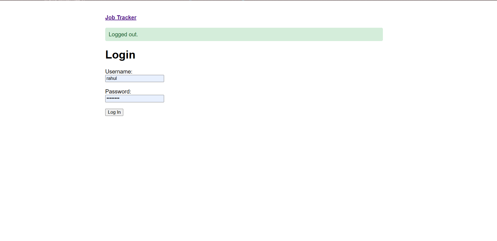
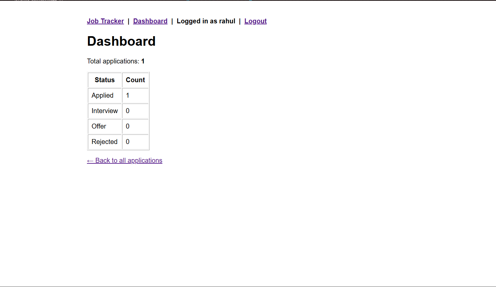
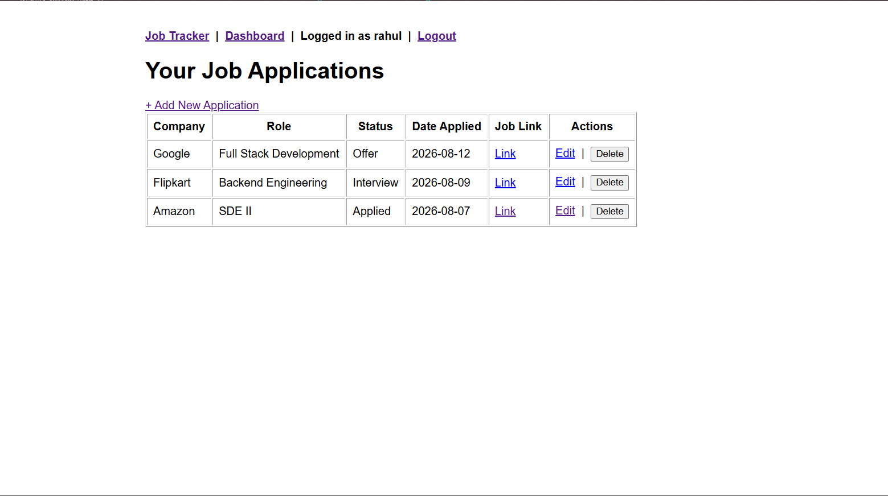

# Job Application Tracker

A self-hosted web app to track job applications end-to-end — built to practice full-stack Flask development, containerization, and CI/CD deployment.

🔗 **Live demo:** [job-tracker-kvj9.onrender.com](https://job-tracker-kvj9.onrender.com)





## Features

- Add, view, edit, and delete job applications (company, role, status, date applied, notes, job posting link)
- Sortable applications table
- Dashboard with application counts per status (Applied / Interview / Offer / Rejected)
- Session-based authentication (single-user, self-locking registration)
- Flash messages for user feedback on actions
- Fully containerized with Docker + Docker Compose
- Automated CI (linting + tests) and CD (auto-deploy to Render) via GitHub Actions

## Tech Stack

| Layer | Technology |
|---|---|
| Backend | Flask (plain view functions, no Blueprints) |
| Templates | Jinja2 (server-rendered HTML) |
| Database | PostgreSQL |
| ORM / Migrations | SQLAlchemy (Flask-SQLAlchemy) + Flask-Migrate |
| Auth | Flask-Login (session-based, hashed passwords via Werkzeug) |
| Testing | Pytest (in-memory SQLite for isolated test runs) |
| Linting | Flake8 |
| Containerization | Docker + Docker Compose |
| CI/CD | GitHub Actions |
| Hosting | Render (web service + managed PostgreSQL) |

## Architecture & Deployment Flow

```
Push to main
     │
     ▼
GitHub Actions CI
  ├─ flake8 (lint)
  └─ pytest (automated tests, in-memory SQLite)
     │
     ▼ (only if CI passes)
GitHub Actions CD
  └─ triggers Render deploy hook
     │
     ▼
Render rebuilds Docker image → redeploys → live at job-tracker-kvj9.onrender.com
```

Every push to `main` is linted and tested before it's ever allowed to deploy — if either check fails, the deploy step never runs.

## Local Setup

### Prerequisites
- Python 3.12+
- Docker + Docker Compose

### Run with Docker (recommended)

```bash
git clone https://github.com/rk936503/job-tracker.git
cd job-tracker
cp .env.example .env   # fill in your own values
docker-compose up --build
```

In a second terminal, run migrations:
```bash
docker-compose exec web flask --app app.py db upgrade
```

Visit `http://127.0.0.1:5000`, then go to `/register` to create your account (registration automatically closes after the first user is created).

### Run locally without Docker

```bash
python -m venv venv
source venv/bin/activate   # Windows: venv\Scripts\activate
pip install -r requirements.txt
cp .env.example .env       # fill in your own values, pointing DATABASE_URL at a local Postgres instance
flask --app app.py db upgrade
python app.py
```

### Run tests

```bash
pytest
flake8 .
```

## Future Improvements

- **Multi-user support** — add a `user_id` foreign key on applications, scope all queries to `current_user`, and open registration permanently
- Search/filter applications by company or status
- Email reminders for follow-ups
- Export applications to CSV

## License

This project is open source and available under the [MIT License](LICENSE).
